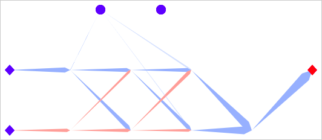

# ascendency, neural networks & cycle propogation

i had a crazy idea and wanted to see it work. in "Ecology, The Ascendent
Perspective" Robert Ulanowicz explains how ecosystems change over time; and i
think, how all networks self-optimise. the ascendent perspective has always been
second nature to me: the foundation for my spiritual, intellectual, and creative
thinking. i took the principles from an ecology textbook and used them to train
a neural network

when chemicals ignite they produce heat, which ignites more of the substrate,
producing more heat - an autocatalytic cycle. dust in a protoplanetary disk
travels in cycles too, some cycles more effcient than others (better at
conserving angular momentum). good cycles are autocatalytic relative to others;
weak cycles are pruned. ascendency means "rising together". as ascendency in a
system increases its cycles become: homogenous, specialised, effcient, complex,
productive, brittle, insular, and slow-changing

ascendency explains the success of shipping containers, the poor resilience of
modern crops, the economic shift toward niche startups, rising suicide rates,
and everything else too. i started building a network simulator for studying
socioeconomic issues, and then i asked myself "can this tool learn?"

shifting some % of each flow's weight backward increases a network's ascendency.
after a few iterations square networks become perfect cycles, and larger grids
develop cycles with fractal complexity

 

values travel through the network boosting weight transfer as they move, and
transfers are amplified when the output is correct. cycles which yield correct
answers are autocatalytic and become stronger. this network learns to minimise
`mse(output, [100, 100])`


an exchange (one input, many outputs) splits a value by weighted average.
therefore weights are effectively constrained to values between 0 & 1, and the
sum of each exchange's weight is always 1. i introduced negative values, bias,
activation, normalisation, and slope. this network learns to flip a signal


unfortunately... flipping signals is almost the limit of what my networks can
learn. they can approximate AND/OR but fail to learn NAND/XOR. the constraints
are too severe and i'm sure my approach is fundamentally flawed (but don't know
how)



| _**AND**_ | in1 | in2 | target |   out | _**OR**_ | in1 | in2 | target |   out |
| --------- | --: | --: | -----: | ----: | -------- | --: | --: | -----: | ----: |
|           |   1 |   1 |      1 |  1.20 |          |   1 |   1 |      1 |  1.49 |
|           |   1 |  -1 |     -1 | -1.10 |          |   1 |  -1 |      1 |  1.01 |
|           |  -1 |   1 |     -1 | -1.02 |          |  -1 |   1 |      1 |  0.95 |
|           |  -1 |  -1 |     -1 | -1.49 |          |  -1 |  -1 |     -1 | -1.23 |

i'm unsure whether this paradigm for training neural networks could match back
propogation. but if someone can make it work there will be some exciting
possibilities for sure! by flipping flows these networks could restructure
themselves: create memory capacitors, fine-tune recurrence, and syncronise
values through time. i can't help but wonder whether task-independent
autocatalysis could enable AI systems to consider original goals, possess an
innate curiosity, and exhibit volition

## running the simulator

there is no user interface. you must edit the source code to change the program
(look at [./pages/index.js](./pages/index.js))

```sh
git clone git@github.com:ashtonsix/ascendency.git
cd ascendency
npm install
npm run dev
```
